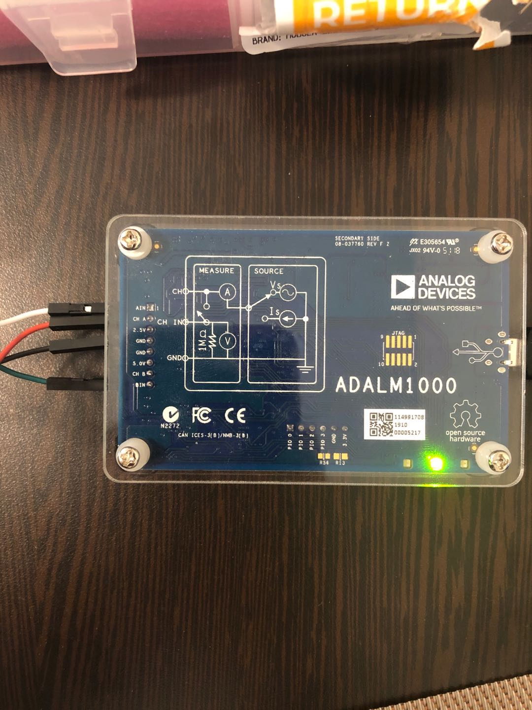
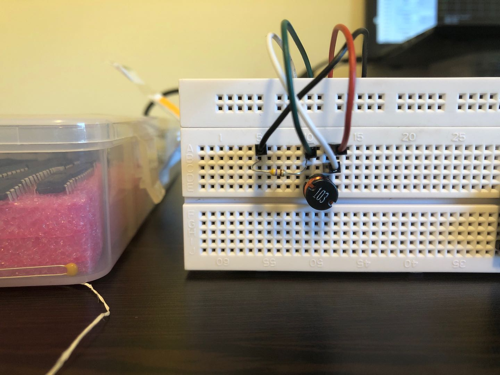
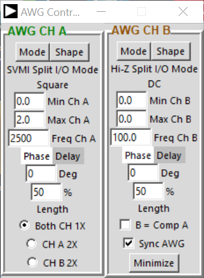
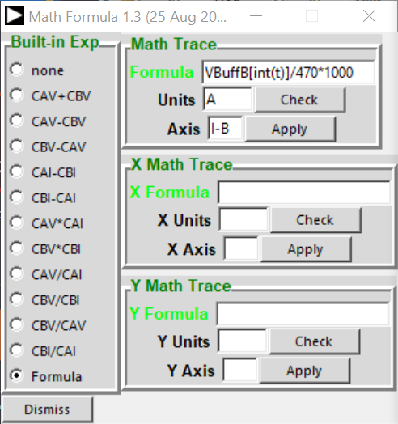
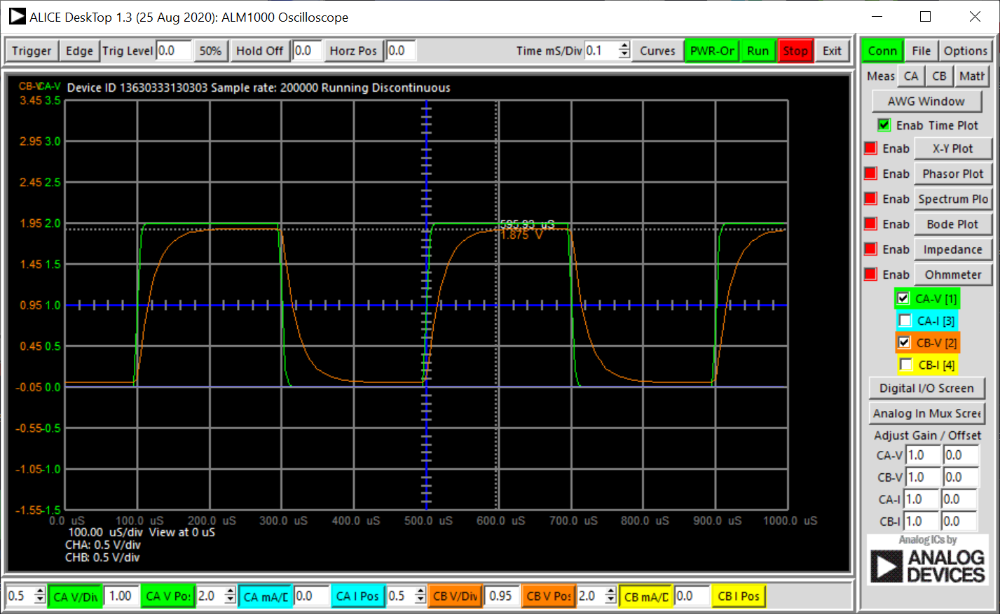
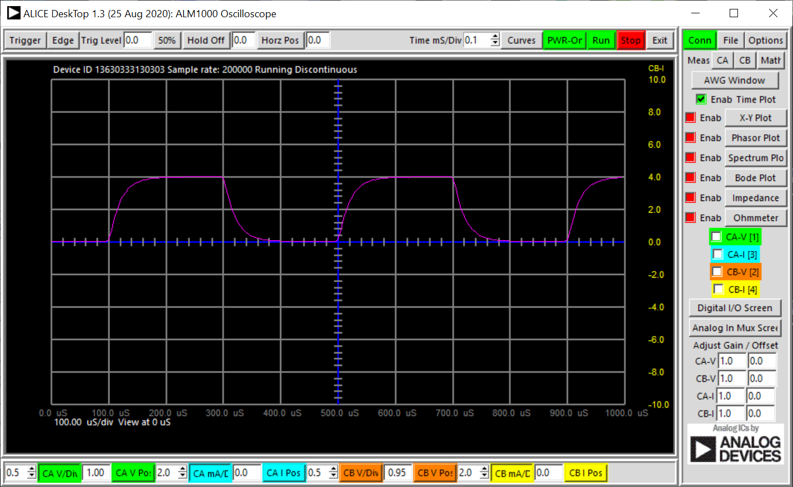
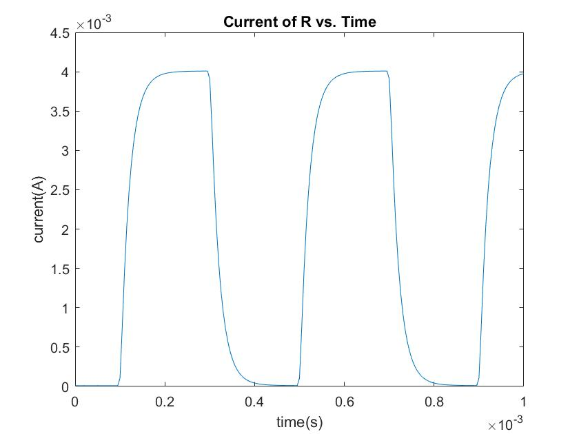

# Experiment 17 Description
...
## Experiment 1 Setup

The goal of this experiment is to measure current across the resistor when the circuit is a RL series circuit.

Channels used
* AIN -> Measuring Prob A
* CHA -> Voltagr source
* GND -> Ground
* BIN -> Measuring Prob B

Components used
* 470 Ohm resistor
* 10 mH inductor (labeled 103)

Software used
* M1K Oscilloscope
* MATLab

### Hardware Diagram





### Software Diagram




For `Built-in Exp` please select `Formula`, doing this will plot Math Trace on the oscilloscope.
Then `Math Trace` you will enter: ` VBuffB[int(t)]/470 * 1000 `
* VBuffB is voltageB samples
* 470 is the resistor value
* You multiply 1000 such that you can scale up the plot so it can actually be observed on the software (the software does not allow current measurement/division go below 0.1)
    * If the current value was needed to be use in calculation, I recommend using Matlab to plot the current plot with the right value and not relying on too much on oscilloscope software, `I use the oscilloscope to observe shape of the signal`, not really interested in the value.



The green plot is the Vin, voltage of the source
The organge plot is the Vr, voltage across resistor



The pink plot is the current across the resistor. 
(Note: the axis is showing CB-I and it's measured in mA/t)

Configuration file can be located at the location here: `.\data\part-a\config.cfg`

CSV file can be located at the location here: `.\data\part-a\Vin_Vr.csv`

### Code to Generate the Current vs. Time Plot




```matlab
% Organize data
Array=readtable('vin_vr.csv');
time = Array{:, 1}; % the first column is time in s
CHA_V = Array{:, 2}; % the 2nd column is Vin in V
CHB_V = Array{:, 3};    % the 3rd clumn is Vr in V
R = 470;            % resistor value in Ohm
figure()            % open a window to plot
plot(time, CHB_V/R)   % plotting (t, Vr/R);
% Customize Plot 
title("Current of R vs. Time");
xlabel('time(s)');
ylabel('current(A)');
xlim([0 0.001]);
```

## Experiment 2 Setup